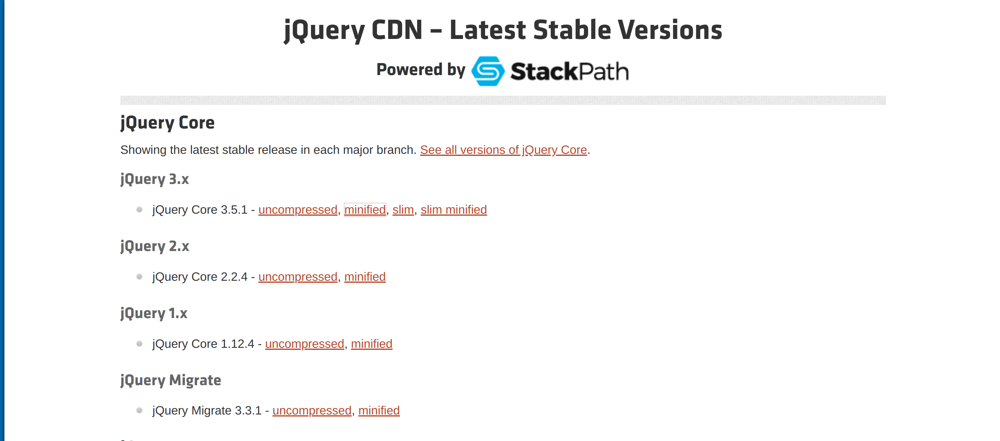
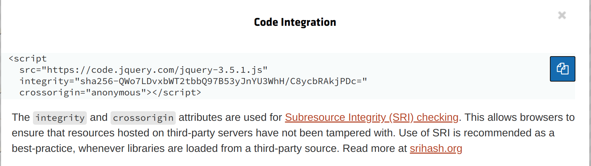

# Primeros pasos jQuery
 * jQuery es una librería que simplifica lo que hacemos en JS, y que proporciona plugins
 * muy usado en proyecto monolíticos en los que se une front y back
 * aplicaciones SPA (frontend y backend separado) se usa Angular y React pero no jQuery

## 1. Descargar jQuery

[página de jQuery](https://code.jquery.com/)

Se puede pegar un trozo de código en nuestro body para instalar jQuery





```html
<!DOCTYPE html>
<html lang="en">
<head>
    <meta charset="UTF-8">
    <title>Primeros Pasos con jQuery</title>
</head>
<body>
<h1>Primeros Pasos con jQuery</h1>
<p>Ejercicios de jQuery</p>

<script
        src="https://code.jquery.com/jquery-3.5.1.js"
        integrity="sha256-QWo7LDvxbWT2tbbQ97B53yJnYU3WhH/C8ycbRAkjPDc="
        crossorigin="anonymous">
</script>
<!--compruebo que se ha cargado correctamente jQuery en la consola de mi navegador con el siguiente script-->
<script>
    $(document).ready(
        function (){
            console.log("jQuery y la web cargados")
        }
    )
</script>
</body>
</html>
```

O podemos abrir el [enlace del script](https://code.jquery.com/jquery-3.5.1.js) en nuestro navegador y dar a guardar como y poner directamente esta ruta en nuestro navegador (así solo dependemos de nuestro navegador, por lo que esta forma es mejor).

```html
<!DOCTYPE html>
<html lang="en">
<head>
    <meta charset="UTF-8">
    <title>Primeros Pasos con jQuery</title>
</head>
<body>
<h1>Primeros Pasos con jQuery</h1>
<p>Ejercicios de jQuery</p>

<script src="jquery-3.5.1.js"></script>
<!--compruebo que se ha cargado correctamente jQuery en la consola de mi navegador con el siguiente script-->
<script>
    $(document).ready(
        function (){
            console.log("jQuery y la web cargados")
        }
    )
</script>
</body>
</html>
```

## 2. Versiones de jQuery

* La versión 1 es muy pesada porque cada navegador antiguo funcionaba de una manera distinta
* Versión 2 eliminó compatibilidades con versiones antiguas de explorer
* Versión 3: soporte a promesas y más compatible con HTML5
* Todas las versiones de jQuery funcionan igual y el código que vamos a ver funciona en todas las versiones
