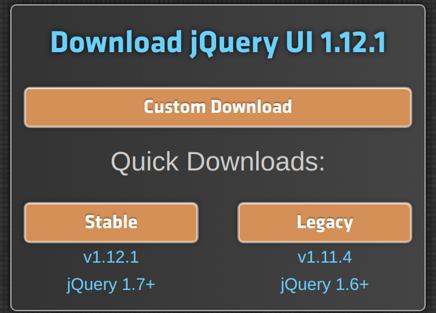

# jQueri

* Es una librería muy común que facilita mucho trabajar con Java Script.
* jQueri a su vez tiene muchas liberías/plugins que a su vez nos facilitan el trabajo.
* jQueriUI es un plugin oficial de jQueri.
* Métodos para facilitarnos tareas como acordeones, ventanas de dialogo, sliders, calendarios, select menu, galería con diferentes temas ya hechos, etc.
* [jqueryui.com](https://jqueryui.com/)

## 1. Descargar jQueriUI:



* Si solo necesito las funciones básicas de JavaScript tengo que referenciar el archivo jquery-ui.min.js en mi html

Incorporo a mi
```html
<!DOCTYPE html>
<html lang="en">
<head>
    <meta charset="UTF-8">
    <title>Utilizando jQueriUI</title>

    <script type="text/javascript" src="jquery-3.5.1.js"></script>
    <script type="text/javascript" src="jquery-ui-1.12.1/jquery-ui.min.js"></script> <!-- solo me habilita las funciones báscias de JavaScript-->
    <script type="text/javascript" src="jQueriUI.js"></script>
    <style>
        .elemento{
            width: 300px;
            height: 200px;
            line-height: 200px; /* para alinear en el centro */
            border: 4px solid black;
            background: lightskyblue;
            margin: 20px;
            float:left;
            text-align: center;
            tex: 100px;
        }
    </style>

</head>
<body>
<h1>Utilizando jQueriUI</h1>

<div class="elemento"> Hola, soy el elemento 1</div>
<div class="elemento"> Hola, soy el elemento 2</div>
<div class="elemento"> Hola, soy el elemento 3</div>


</body>
</html>
```

## 2. Mover elementos por la página con .dragabble()

A las clases seleccionadas le aplicamos el método draggabke y me va a permitir que los mueva por la pantalla del navegador
```jsx
$(document).ready(()=>{
    $('.elemento').draggable();
})
```

## 3. Redimensionar elementos con .resizable()

Primero cargamos los archivos css de jQueryUI (jquery-ui.min.css, jquery-ui.structure.css, jquery-ui.min.js) e incorporamos una lista al archivo html:
```html
    <script type="text/javascript" src="jquery-3.5.1.js"></script>
    <link rel="stylesheet" href="jquery-ui-1.12.1/jquery-ui.min.css">
    <link rel="stylesheet" href="jquery-ui-1.12.1/jquery-ui.structure.css">
    <link rel="stylesheet" href="jquery-ui-1.12.1/jquery-ui.theme.css">
    <script type="text/javascript" src="jquery-ui-1.12.1/jquery-ui.min.js"></script> <!-- solo me habilita las funciones báscias de JavaScript-->
    <script type="text/javascript" src="jQueriUI.js"></script>
```

```jsx
    $('.lista-seleccionable').selectable()
```
## 4. Seleccionar elementos con .selectable()

* Incorporamos una lista al archivo html con sus estilos.
* También incorporamos clases especificas de jQueriUI y le damos estilo (.ui-selecting, .ui-selected)
```html
       <!-- ... -->
   <head>
       <!-- ... -->
           .lista-seleccionable li{
                       width: 80%;
                       padding: 20px;
                       border: 1px solid #ccc;
                       list-style: none;
                       cursor: pointer;
                   }
           
                   ul .ui-selecting {background: yellow} /* esta clase la va a aplicar cuando seleccione un elemento de ul*/
                   ul .ui-selected {background: blue}
       <!-- ... -->
       </style>
   
   </head>
   <body>
   <h1>Utilizando jQueriUI</h1>
   
   <ul class="lista-seleccionable">
       <li>Super Mario Bros 3</li>
       <li>Sonic the Hedgehog</li>
       <li>Simon the Sorcerer</li>
       <li>Warcraft II: Tides of Darkness</li>
   
   </ul>
          <!-- ... -->

```

```jsx
$(document).ready(()=>{
    console.log("jQueri cargado correctamente");

    //2. Mover por la página
    $('.elemento').draggable();

    //3. Redimensionar
    $('.elemento').resizable();

    //3. Seleccionar
    $('.lista-seleccionable').selectable()
})
```

## 5. .sortable(): listar y ordenar elementos

Añado una nueva lista
```html
<ul class="lista-sortable">
    <li>Batman Arkham Asylum</li>
    <li>Unteral Tournament 1999</li>
    <li>Little Big Adventure</li>
    <li>The Last of Us</li>
```
Ordeno y puedo recoger esos datos con el método update
```jsx
  //4. ordenar
    $('.lista-sortable').sortable({
        update: function (event, ui){
            console.log('ha cambiado la lista')
            //Aquí podría utilizar un bucle para ver las posiciones elegidas
        }
    })
```

## 6. .dropable(): soltar y arrastrar

Creo dos nuevos divs: area y elemento movido
```html
<div id="area"></div>
<br>
<div id="elementoMovido"></div>
```
```jsx
  //6. Drop + draggable

    $("#elementoMovido").draggable();
    $("#area").droppable({
        drop: function (){
            console.log('has soltado algo dentro del área')
        }
    })
```
## 7. Efectos

Creo un div y un botón  para cada efecto y una clase para diferenciar los colores

```html
<!-- ... -->
<style>
/* ... */
.caja-efectos{
            background: lightpink;
            float: none;
        }
/* ... */
</style>

<!-- ... -->
<button id="mostrar">fade</button>
<div id="cajaEfectos" class="caja-efectos elemento"></div>
<hr>
<!-- ... -->
```
```jsx
 //Efectos
 
     // ### FADE
     $("#mostrar").click(function (){
         $(".caja-efectos").fadeToggle() //este es un método nativo de jQuery, no es necesario jQueriUI
     });
 
     // ### EXPLODE
     $("#mostrar2").click(function (){
         $(".caja-efectos2").toggle("explode", "slow") //este NO es un método nativo de jQuery, tenemos que usar el método intermedio effect/ o toggle
     });
 
     // ### Blind
     $("#mostrar3").click(function (){
         $(".caja-efectos3").effect("blind", 4*1000)
     });
 
     // ### Blind
     $("#mostrar4").click(function (){
         $(".caja-efectos4").toggle("slide", "slow")
     });
 
     // ### Drop
     $("#mostrar5").click(function (){
         $(".caja-efectos5").toggle("drop", "normal")
     });
 
     // ### Fold
     $("#mostrar6").click(function (){
         $(".caja-efectos6").toggle("fold", "fast")
     });
 
     // ### Puff
     $("#mostrar7").click(function (){
         $(".caja-efectos7").toggle("puff", "slow")
     });
 
     // ### Scale
     $("#mostrar8").click(function (){
         $(".caja-efectos8").toggle("scale")
     });
 
     // ### Shake
     $("#mostrar9").click(function (){
         $(".caja-efectos9").toggle("shake")
     });
```

## 8. Widget

### 8.1 Tooltip
* Es una especie de pop up que aparece cuando pasas por encima algún elemento.

Creo enlaces y con .tooltip() me va a mostrar el title del enlace si me pongo encima de este
```html
<h2>WIDGETS</h2>
<h3>Tooltip</h3>

<a href="#" title="acceder a la sección de mis datos de esta web">Mis datos</a>
<br>
<a href="#" title="Este enlace es para identificarse">Identificarse</a>
<br>
<a href="#" title="Este enlace es para ver a mis amigos">Ver amigos</a>
```
```jsx
 // ## WIDGETS

    // ### Tooltips
    $(document).tooltip();
```

### 8.2 Popup
* Es una especie de popup que aparece cuando pasas por encima algún elemento.
* Creo enlaces y con .tooltip() me va a mostrar el title del enlace si me pongo encima de este

```html
<div id="popup" title="Te encanta JavaScript y lo sabes!">
    Me encanta JavaScript
</div>
```

```jsx
   // ### Dialog
    $('#lanzarPopup').click(()=>{
        $("#popup").dialog();
    })
```

### 8.3 Date-picker / Calendario

```html
<h3> .datepicker() - Calendario</h3>
<input type="text" id="calendario">
<hr>
```

```jsx
    // ### Datepicker
    $('#calendario').datepicker();
```

### 8.4 Pestañas / .tabs()

```html
<h3> .tabs() - Pestañas</h3>
<div id="pestanas">
    <ul>
        <li><a href="#tab1">Pestaña1</a> </li>
        <li><a href="#tab2">Pestaña2</a> </li>
        <li><a href="#tab3">Pestaña3</a> </li>
        <li><a href="#tab4">Pestaña4</a> </li>
    </ul>
    <div id="tab1">Hello, soy la pestaña 1</div>
    <div id="tab2">Hello, soy la pestaña 2</div>
    <div id="tab3">Hello, soy la pestaña 3</div>
    <div id="tab4">Hello, soy la pestaña 4</div>
</div>
```

```jsx
  // ### Pestañas
    $('#pestanas').tabs();
```
