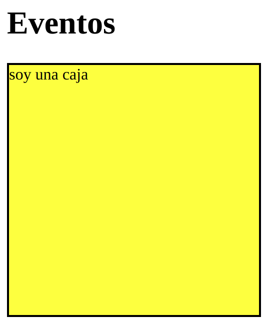

# Eventos

## 1. Eventos MouseOver y MouseOut

Podemos hacer los eventos en CSS tipo MouseOver con hover

```html
<!DOCTYPE html>
<html lang="es">
<head>
    <meta charset="UTF-8">
    <title>Eventos</title>

    <script type="text/javascript" src="jquery-3.5.1.js"></script>
    <script type="text/javascript" src="eventos.js"></script>
    <style>
        #caja{
            width: 250px;
            height: 250px;
            border: 2px solid black;
            background: yellow;
            transition: 900ms all;
        }
        #caja:hover{
            transition: 900ms all; //si pongo aquí la transición solo se pone suave al entrar, la pongo en #caja para que sea suave al entrar y al salir
            background: red;
            cursor: pointer;
        }
    </style>
</head>
<body>
<h1>Eventos</h1>

<div id="caja">
    soy una caja
</div>

</body>
</html>
```


en JavaScript utilizando jQuery sería de la siguiente forma:
```jsx
$(document).ready(function (){
    //alert('eventos cargado');

    //Eventos MouseOver y MouseOut
    let caja = $("#caja");
    caja.mouseover(function (){
        $(this).css("background","red");
        $(this).css("transition","900ms all");
        $(this).css("cursor","pointer");
    });

    caja.mouseout(function (){
        $(this).css("background","green");
        $(this).css("transition","900ms all");
    });
})
```
## 2. Hover

El hover hace lo mismo que en el apartado anterior pero simplificado

```jsx
 let caja = $("#caja");

    function cambiaRojo(){
        $(this).css("background","red");
        $(this).css("transition","900ms all");
        $(this).css("cursor","pointer");
    }

    function cambiaVerde(){
        $(this).css("background","green");
        $(this).css("transition","900ms all");
        $(this).css("cursor","pointer");
    }

    caja.hover(cambiaRojo,cambiaVerde);
```
## 3. Click, Doble Click
Hacemos que nuestra caja cambie de color al hacer click y doble click

```jsx
    let caja = $("#caja");

    caja.click(function (){
        $(this).css("background","blue");
        $(this).css("color","white");
        $(this).css("transition","900ms all");
        $(this).css("cursor","pointer");
    })

    caja.dblclick(function (){
        $(this).css("background","purple");
        $(this).css("color","yellow");
        $(this).css("transition","900ms all");
        $(this).css("cursor","pointer");
    })
```
## 4. Focus - Blur

* Introducimos un formulario form y un div #datos en nuestro html para poder probar las funcionalidades
* Creando la variable nombre, evito acceder tantas veces al DOM y JS va más rápido:
```jsx
    let nombre = $("#nombre")
```

#### Focus - Seleccionar
```jsx
 //Focus: cuando selecciono el formulario se activan mis comportamientos
    nombre.focus(function (){
        $(this).css("border", "2px solid red");
        $(this).css("background", "orange");
        $(this).css("color", "yellow");

    });
```
#### Blur - Seleccionar - seleccionar otro elemento diferente al que estaba seleccionado

```jsx
 //Blur: cuando dejo de seleccionar el formulario se activan mis comportamientos
    nombre.blur(function (){
        $(this).css("border", "5px solid green");
        $(this).css("background", "lightblue");
        $(this).css("color", "violet");

        //Mostrar los datos que ponga en el formulario en el div #datos
        $("#datos")
            .text($(this).val())//con el método text me escribo los datos que he recogido con el método val
            .show()//Con el método show hago que aparezca el div al que le puse display none
    });
```
 ## 6. MouseMove
 * captura el evento de movimiento del ratón
 * creo el div #coordenadas y el div #folloMe para este ejercicio
```jsx
 $(document).mousemove(function (){
        $("#coordenadas")
            .text(
              `Eje X : ${event.clientX}; Eje Y : ${event.clientY}`
            );
        //Hago un div con forma redonda que me siga
        $("#followMe")
            .css("left",event.clientX)
            .css("top",event.clientY)
        //Hago desaparecer el cursor de mi ratón
        $('body').css("cursor","none");
    })
```
El html utilizado queda así:
```html
<!DOCTYPE html>
<html lang="es">
<head>
    <meta charset="UTF-8">
    <title>Eventos</title>

    <script type="text/javascript" src="jquery-3.5.1.js"></script>
    <script type="text/javascript" src="eventos.js"></script>
    <style>
        #caja{
            width: 250px;
            height: 250px;
            border: 2px solid black;
            background: yellow;
            /*transition: 900ms all;*/
        }
        /*#caja:hover{
            transition: 900ms all; //si pongo aquí la transición solo se pone suave al entrar, la pongo en #caja para que sea suave al entrar y al salir
            background: red;
            cursor: pointer;
        }*/

        input{
            padding: 10px;
            width: 300px;
            font-size: 20px;
        }

        #datos{
            border: 4px dashed darkmagenta;
            padding: 10px;
            width: 250px;
            height: 50px;
            margin-top: 30px;
            display: none;/* así lo acultamos hasta que se ejecute el blur*/
        }

        #coordenadas{
            border: 4px dashed darkmagenta;
            padding: 10px;
            width: 250px;
            height: 50px;
            margin-top: 30px;
            display: block;
        }

        #followMe{
            width: 100px;
            height: 100px;
            position: absolute;
            display: block;
            background: yellow;
            opacity: 0.5;
            border-radius: 999px;
            border: 1px solid purple;

        }

    </style>
</head>
<body>
<h1>Eventos</h1>

<div id="caja">
    soy una caja
</div>

<br>

<form>
    <input type="text" id="nombre">
</form>


<div id="datos"></div>

<div id="coordenadas"></div>

<div id="followMe">follow me</div>


</body>
</html>
```